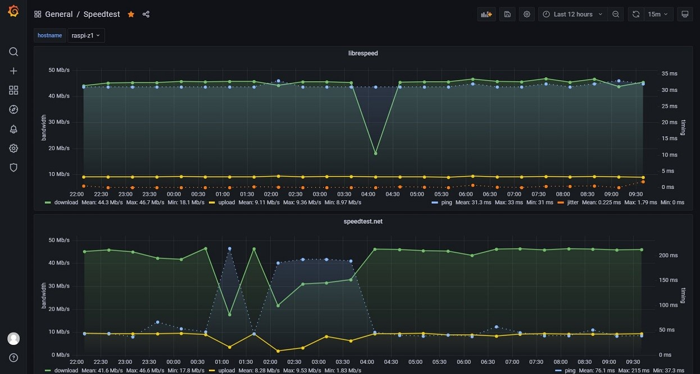

# speedtest2influx

This is a shell script to process internet speedtests (using librespeed.org and speedtest.net) and put the results into a influxdb. Additional there's a grafana dashboard to visualize the results.

If running shell script in interactive shell you can see raw json result and curl response of the different DB calls.

## Requirements

You need to have cli tools of librespeed.org and speedtest.net installed previous running the script

* [sivel/speedtest-cli: Command line interface for testing internet bandwidth using speedtest.net](https://github.com/sivel/speedtest-cli)
* [librespeed/speedtest-cli: Command line client for LibreSpeed](https://github.com/librespeed/speedtest-cli)

Install them according to their manual via package manager or binary from git repo. The tools need to be installed in search path e.g. `/usr/bin/` (refer $PATH).

For processing it is also necessary to have the following packages installed:

* jq
* curl

## Getting started

Edit the conf with your database parameters and install required packages as stated above.

## Automation

You can trigger regular runs in crontab, e.g. `15 * * * * /yourpath/speedtest2influx.sh` to run every hour.
